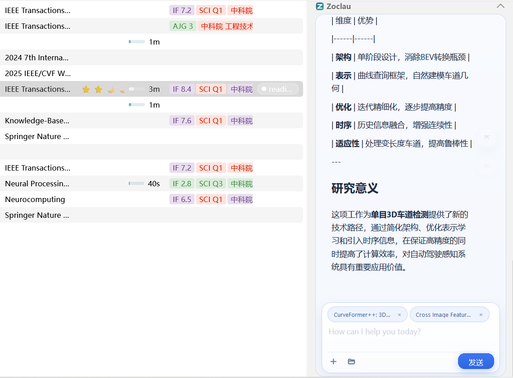
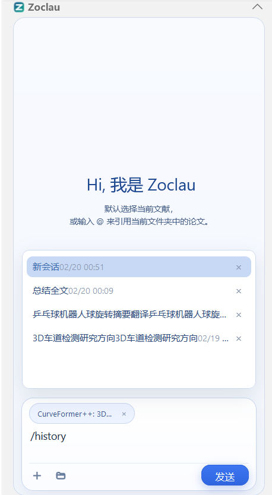
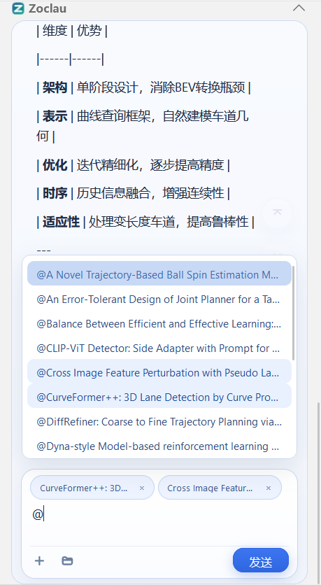
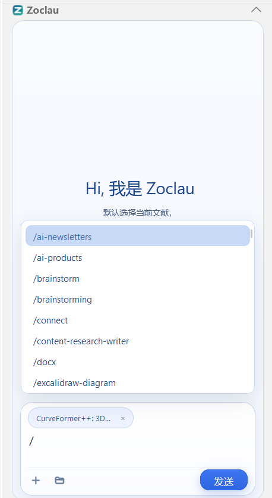

# 🚀 Zoclau

[English](README.md) • [中文文档](README.zh-CN.md)

Zoclau is a Zotero 7 plugin that embeds Claude Code directly into the Zotero sidebar, empowering you to chat, analyze, and work seamlessly with local context during your literature research.

<div align="center">
  
</div>

---

## ✨ Features

- 💬 **Embedded Chat Panel**: Chat directly within the Zotero item pane.
- ⚡ **Streaming Responses**: Real-time generation of Claude's answers.
- 📜 **Conversation History**: Easily manage and switch between past conversations.
- 📂 **Local Context Picker**: Multi-folder selection, precise count badges, and list management.
- 🔗 **Item/Folder Mentions**: Quickly reference items as context.
- 🛡️ **Configurable Permission Modes**:
  - `yolo` (no prompt, execute immediately)
  - `normal` (safer, requires confirmation)
  - `plan` (exploration and planning first)

---

## 💻 Requirements

- **Zotero 7**
- **Claude Code CLI** installed and available in your system path
- **Windows users**: Git Bash is highly recommended (or define `CLAUDE_CODE_GIT_BASH_PATH` in settings)

---

## 📖 Usage

- **Basic Chat**: Interact directly with Claude Code in the right-side chat panel.
- **Manage History**: Type `/history` to view, switch, and manage your past chat sessions.
- **Context Mentions**: Use `@` to reference specific Zotero items or papers, injecting highly relevant context into your conversation.
- **Skills & Tools**: Leverage Claude Code's capabilities to explore your local data and execute complex tools.

### Interface

| 📜 History Command | 📎 Cite Papers / Items | 🛠️ Skills & Tools |
| :---: | :---: | :---: |
|  |  |  |

---

## 📦 Install

### Option A: Install from Release (⭐ Recommended)

1. Download the latest `zoclau.xpi` from the [GitHub Releases](https://github.com/Folozz/Zoclau/releases) page.
2. In Zotero, go to `Tools` -> `Plugins`.
3. Click the gear icon ⚙️ in the top right -> select `Install Plugin From File...`.
4. Select the downloaded `zoclau.xpi`.
5. Restart Zotero when prompted.

### Option B: Build from Source

```bash
# 1. Install dependencies
npm install

# 2. Build the project
npm run build

# 3. Pack into an .xpi file
node pack-xpi.cjs
```

**Build Artifacts**:
- `build/addon/`: The unpacked Zotero add-on folder
- `zoclau.xpi`: The packaged, installable plugin

---

**Key Files & Architecture**:
- `src/index.ts` - Plugin entry point and Zotero lifecycle integration
- `src/service/ClaudeService.ts` - Handles the Claude CLI process and streaming
- `src/ui/ChatPanel.ts` - Chat interface UI and interactions
- `content/preferences.xhtml` & `content/preferences.js` - Zotero settings UI and auto-save logic
- `esbuild.config.mjs` - Bundling and static file copy pipeline

---

## 📄 License

[MIT License](LICENSE)
